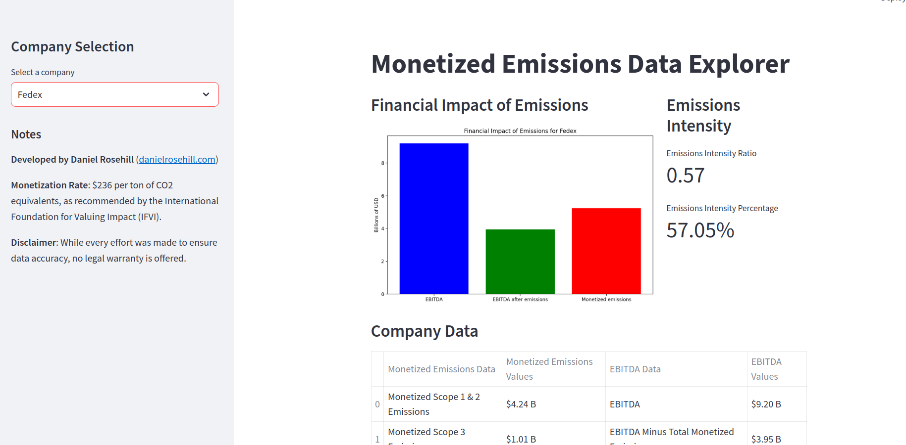
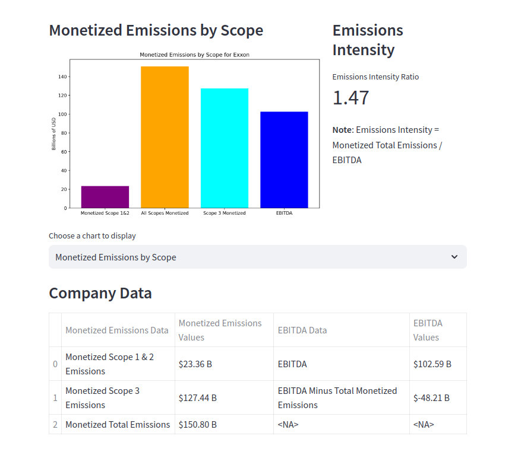
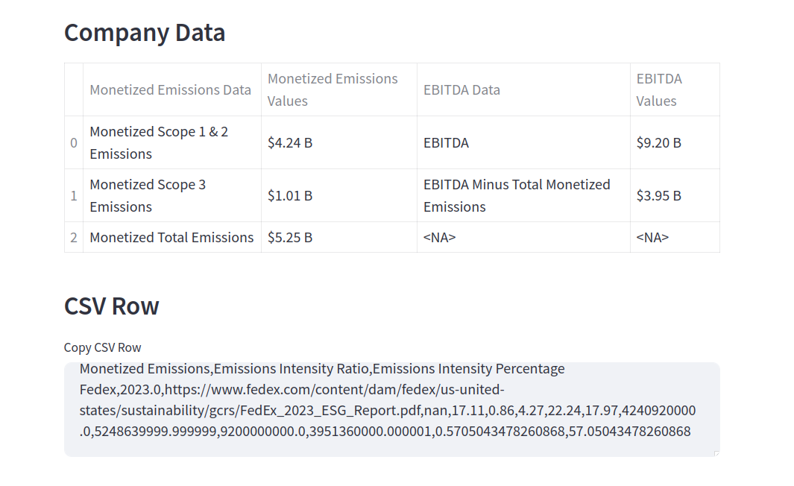
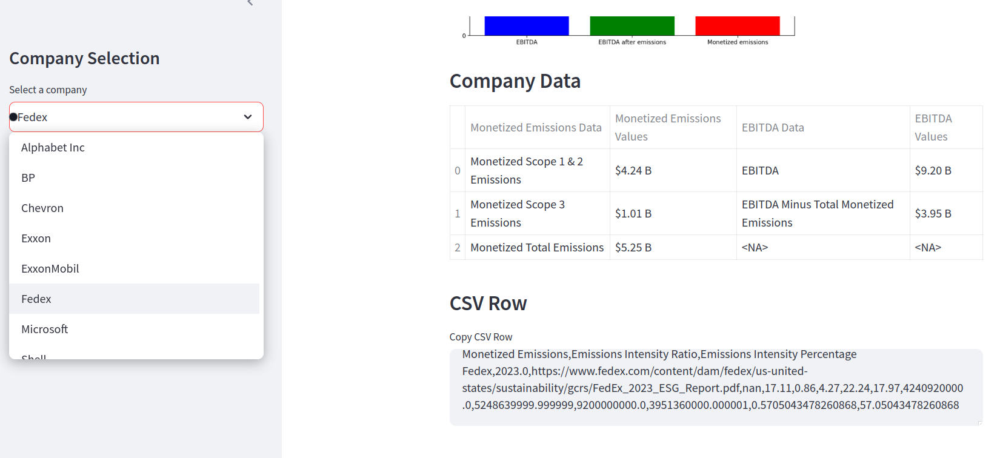
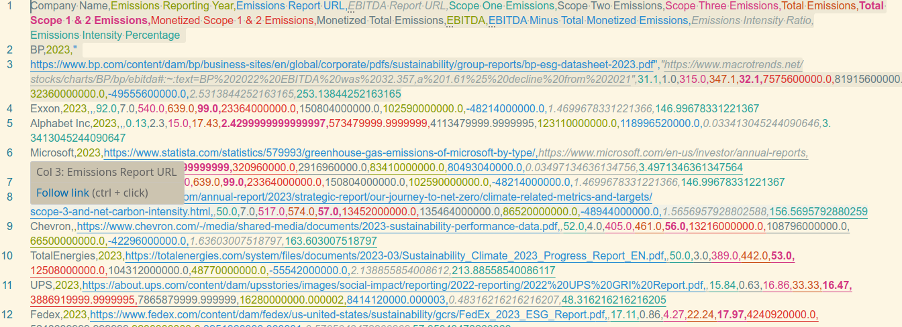

# GHG-EBITDA Correlation Analysis

### Purpose
This GitHub repository is designed to house data derived from publicly available sources. The primary focus is on listing Scope 1, 2, and 3 greenhouse gas (GHG) emissions for various publicly traded companies. Additionally, it provides a comparison of the estimated total monetized emissions against the companies' **EBITDA** (Earnings Before Interest, Taxes, Depreciation, and Amortization).

### Data Standardization and Units
To ensure consistency in reporting, every effort has been made to standardize greenhouse gas data into a uniform unit of **millions of metric tons of carbon dioxide equivalents (MTCO2e)**. In some cases, this required converting data from other units into MTCO2e.

### Data Sources
Where possible, the source of each company's sustainability disclosure has been recorded. First-hand primary sources, such as disclosures directly from the companies themselves, are preferred to ensure reliability.

### Accuracy and Presentation
While every effort has been made to ensure the accuracy of the data, this information is presented on a **best-effort basis** due to potential limitations in available disclosures and methodologies.

### Emissions Intensity Ratio
The emissions intensity ratio is calculated by comparing the monetized emissions across all three scopes (Scope 1, Scope 2, and Scope 3) against the company's EBITDA. 

### Monetization Methodology
The monetization of emissions is carried out at a rate of **$236 per metric ton of CO2 equivalents**, as recommended by the International Foundation for Valuing Impacts (IFVI). 

## Screenshots

## Author

Daniel Rosehill  
(public at danielrosehill dot com)

## Licensing

This repository is licensed under CC-BY-4.0 (Attribution 4.0 International) 
[License](https://creativecommons.org/licenses/by/4.0/)

### Summary of the License
The Creative Commons Attribution 4.0 International (CC BY 4.0) license allows others to:
- **Share**: Copy and redistribute the material in any medium or format.
- **Adapt**: Remix, transform, and build upon the material for any purpose, even commercially.

The licensor cannot revoke these freedoms as long as you follow the license terms.

#### License Terms
- **Attribution**: You must give appropriate credit, provide a link to the license, and indicate if changes were made. You may do so in any reasonable manner, but not in any way that suggests the licensor endorses you or your use.
- **No additional restrictions**: You may not apply legal terms or technological measures that legally restrict others from doing anything the license permits.

For the full legal code, please visit the [Creative Commons website](https://creativecommons.org/licenses/by/4.0/legalcode).